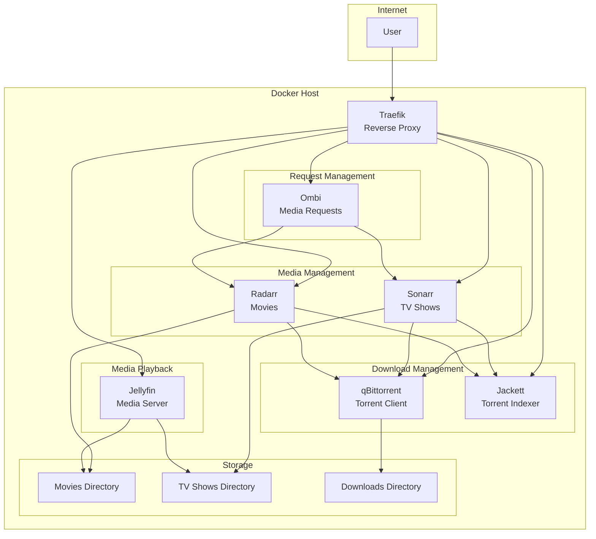

# Media Server Stack

A comprehensive media server deployment solution using Ansible and Docker. This project automates the setup of a complete media server stack including streaming, download management, and media request services.


## Time Table Breakdown

| Phase | Task | Estimated Time (minutes) |
|-------|------|------------------------|
| **Planning** | Research and architecture design | 100 |
|  | Infrastructure planning | 60 |
| **Setup** | Docker and dependency setup | 120 |
| **Configuration** | Traefik reverse proxy configuration | 30 |
|  | Media services container setup | 200 |
|  | Network configuration | 30 |
| **Integration** | Service interconnection | 120 |
|  | Testing and troubleshooting | 60 |
| **Documentation** | Writing documentation | 40 |
| **Total** | Full setup | 780 min or 13 hours |


## Architecture



## Features
- **Jellyfin**: Media streaming server
- **Ombi**: Media request and user management
- **qBittorrent**: Torrent download client
- **Jackett**: Torrent tracker indexer
- **Radarr**: Movie management and automation
- **Sonarr**: TV series management and automation
- **Traefik**: Reverse proxy with automatic SSL certificate management

## Prerequisites
- A server running CentOS/RHEL-compatible Linux
- Ansible installed on your local machine
- Domain name with DNS configured to point to your server IP
- SSH access to the server

## Quick Start
1. Clone this repository:
   ```bash
   git clone https://github.com/yourusername/media-server-stack.git
   cd media-server-stack
   ```

2. Copy and configure the host and vars files:
   ```bash
   cp hosts.example hosts
   cp vars.yml.example vars.yml
   ```

3. Edit the `hosts` file to include your server's IP address and SSH key path:
   ```ini
   [server]
   your.server.ip.address

   [server:vars]
   ansible_ssh_private_key_file=/path/to/your/ssh/key
   ansible_user=your_username
   ```

4. Edit the `vars.yml` file to configure your deployment:
   ```yaml
   puid: "1000"  # Docker user ID
   pgid: "1000"  # Docker Group ID
   tz: Europe/Brussels  # Timezone
   download_dir: /mnt/data/downloads  # Downloads path
   media_dir: /mnt/data/media  # Media storage path
   config_dir: /mnt/data/config  # Configuration path
   traefik_domain: yourdomain.com  # custom domain name
   traefik_basic_auth: "username:hashedpassword"  # Traefik basic auth
   ```

5. Run the deployment:
   ```bash
   ansible-playbook -i hosts media.yml
   ```

## Detailed Configuration

### Security
- All web interfaces are secured behind Traefik's HTTPS
- Default credentials are provided in the deployment output
- IMPORTANT: Change all default passwords after first login

### Directory Structure
```
.
├── mnt/
│   └── data/
│       ├── config/     # Container configs
│       ├── downloads/  # Downloaded content
│       └── media/      # Media library
│           ├── movies/ # Movie files
│           └── tv/     # TV show files
```

### Network Configuration
The deployment creates two Docker networks:
- `traefik_network` - For external communication for UI
- `media_network` - For internal container communication

### Default Ports
| Service     | Default Port |
|-------------|--------------|
| Jellyfin    | 8096         |
| Ombi        | 3579         |
| qBittorrent | 8080         |
| Jackett     | 9117         |
| Radarr      | 7878         |
| Sonarr      | 8989         |
| Traefik     | 80, 443      |

## URL Structure
After deployment, your services will be available at:
- **Traefik Dashboard**: https://traefik.yourdomain.com
- **Jellyfin**: https://jellyfin.yourdomain.com
- **Ombi**: https://ombi.yourdomain.com
- **qBittorrent**: https://qbittorrent.yourdomain.com
- **Jackett**: https://jackett.yourdomain.com
- **Radarr**: https://radarr.yourdomain.com
- **Sonarr**: https://sonarr.yourdomain.com

## Maintenance

### Backing Up
To back up the entire configuration:
```bash
tar -czf media-stack-backup.tar.gz /mnt/data/config
```

### Monitoring

To view logs for a specific container:

```bash
docker logs container-name
```

## Troubleshooting

### Service Not Accessible

1. Check if the container is running:
   ```bash
   docker ps | grep container-name
   ```

2. Check container logs:
   ```bash
   docker logs container-name
   ```

3. Verify Traefik configuration:
   ```bash
   docker logs traefik
   ```

## License

This project is licensed under the MIT License - see the LICENSE file for details.
